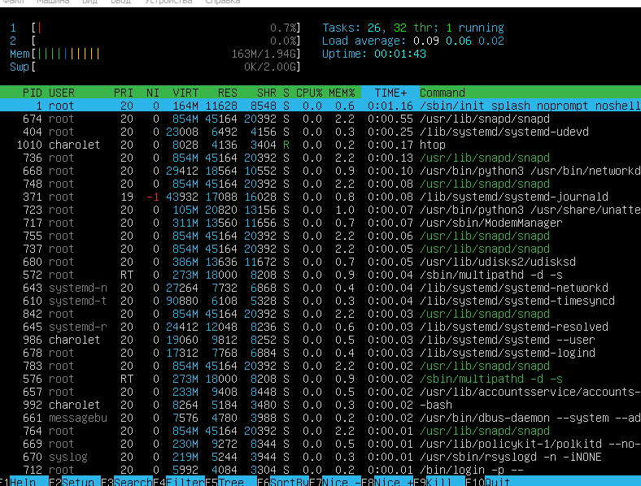
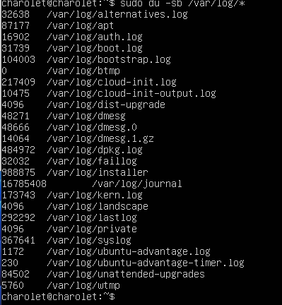

## Part1. Установка ОС

1. 
## Part2. Создание пользователя

1. Вывести информацию о пользователи с командой cat /etc/passwd

## Part3. Настройка сети ОС

1. Изменить имя машины на user-1 

2. Установка временной зоны соотвутсвующей моей

3. Название ситевых интерфейсов  с помощью консольной команды ip a

4. loopback (коротко говоря lo) — это аппаратный или программный метод, который направляет полученный сигнал или данные обратно отправителю. Он используется как дополнительное средство в исправлении проблем физического соединения.

5. С помощью команды ip a получаем ip адресс устройства 

6. DHCP - это клиент-серверный протокол динамической конфигурации хоста (Dynamic Host Configuration Protocol), с помощью которого в ИТ-инфраструктуре сетевые параметры каждого нового устройства прописываются автоматически. Использование DHCP существенно упрощает работу системных администраторов в случаях расширения сети.
7. Определить и вывести на экран внешний ip-адрес шлюза (ip) и внутренний IP-адрес шлюза, он же ip-адрес по умолчанию (gw).

8.  Задать статичные (заданные вручную, а не полученные от DHCP сервера) настройки ip, gw, dns

9. Успешно пропиговать хосты 1.1.1.1 и ya.

## Part 4. Обнавление ОС.

1. Обновление системы командами apdate и upgrade

## Part 5. Использование команды sudo.
- Команда sudo ( substitute user and do, подменить пользователя и выполнить ) позволяет строго определенным пользователям выполнять указанные программы с административными привилегиями без ввода пароля суперпользователя root.
1. Разрешить пользователю, созданному в [Part 2](#part-2), выполнять команду sudo.

## Part 6. Установка и настройка службы времени.
- Устанавливаем Network time protocol `sudo apt install ntp`
- Вывод времени часового пояса в котором  я сейчас нахожусь

## Part 7. Установка и использование текстовых редакторов
- Установка текстового редактора vim `sudo apt install vim`
- Установка текстового редактора nano `sudo apt install nano`
- Установка текстового редактора mcedit `sudo apt install mc`
- Создане файла test_vim.txt  `sudo vim test_vim.txt`, для выхода из редактора с сохранением `Esc`, `:`, `wq`.

- Создание текстового файла test_nano.txt `sudo nano test_nano.txt`, для выхода из редактора с сохранением `Ctrl+0`, `Ctrl+x`

 - Открытие файла test_vim.txt `sudo vim test_vim.txt`, `R` для редактирования `i`, для выхода из файла без сохраненией `Esc`, `:`, `q`
 
 - Поиск содержимого `cat test_nano.txt`
 
 - замена содержимого `cat test_nano.txt`
  
 - изменение содержимого `cat test_nano.txt`
 
 - открытие `cat test_vim.txt`
 
 - Открытие файла `sudo vim test_vim_txt`, поиск слова и замена искоемого `:/School`
 
 - Команда для замены искоемого слова `sudo vim test_vim_txt`

 ## Part 8. Установка и базовая настройка сервиса SSHD
 - Установить пакет openssh `sudo apt install openssh-server`
 - Добавьте пакет SSH-сервера в автозагрузку `sudo systemctl enable sshd`
 - Проверьте работу SSH `systemctl status sshd `
 - Изиенение порта на 2022 `sudo vim /etc/ssh/sshd_config`
 - С помощью команды ps показать наличие sshd 
 
 - ключ -С который фильтрует по имени процесса -A, -e, (a) - выбрать все процессы;
-a - выбрать все процессы, кроме фоновых;
-d, (g) - выбрать все процессы, даже фоновые, кроме процессов сессий;
-N - выбрать все процессы кроме указанных;
-С - выбирать процессы по имени команды;
-G - выбрать процессы по ID группы;
-p, (p) - выбрать процессы PID;
--ppid - выбрать процессы по PID родительского процесса;
-s - выбрать процессы по ID сессии;
-t, (t) - выбрать процессы по tty;
-u, (U) - выбрать процессы пользователя.
Опции форматирования:
-с - отображать информацию планировщика;
-f - вывести максимум доступных данных, например, количество потоков;
-F - аналогично -f, только выводит ещё больше данных;
-l - длинный формат вывода;
-j, (j) - вывести процессы в стиле Jobs, минимум информации;
-M, (Z) - добавить информацию о безопасности;
-o, (o) - позволяет определить свой формат вывода;
--sort, (k) - выполнять сортировку по указанной колонке;
-L, (H)- отображать потоки процессов в колонках LWP и NLWP;
-m, (m) - вывести потоки после процесса;
-V, (V) - вывести информацию о версии;
-H - отображать дерево процессов;
- Вывод команды netstat -tan должен содержать

-n служит для печати IP-адресов вместо имен хостов;
-a показывает состояние всех сокетов; 
-t показывает только tcp соединения;
Значения столбцов:
Proto - протокол, используемый сокетом;
Recv-Q - количество байтов, не скопированных пользовательской программой, подключенной к этому сокету;
Local Address - локальный адрес (имя локального хоста) и номер порта сокета
Foreign Address - удаленный адрес (имя удаленного хоста) и номер порта сокета
State - состояние сокета
0.0.0.0 в этом контексте означает "все IP-адреса на локальной машине"
## Part 9.  Установка и запуск утилиты top и htop.
top - интерактивный просмотрщик процессов. htop аналог top.
1. 

- uptime 31
- авторизовано 1 user
- total system load 0,00
- total number of processes 96
- cpu load  0.0
- memory load 147.6
- pid процессора занимающего больше всего памяти `shift + m` 645 root
- pid процесса занимающего больше всего проыессорного времени 1336 
2. 

- Отчёт отсортированный по PID

- Отчёь отсортированный по PERCENT_CPU

-  Отчёт отсортированный по PERCENT_MEM,

- Отчёт отсортированный по TIME

- Отчёт отфильтрованный по sshd
![filter_sshd]!(images/9/7.png)
- Отчёт отфильтрованынй по syslog

- Отчёт с добавлением hostname , clock. uptime

## Part 10. fdisk

1. Запустите команду fdisk -l

## Part 11. df

1. Запустить команду df 

2. Запустить команду df -Th

## Part 12. du
1. Запустите команду du

- Вывести размер папок /home, /var, /var/log (в байтах, в человекочитаемом виде)
- Вывести размер всего содержимого в /var/log (не общее, а каждого вложенного элемента, используя *)

## Part 13. ncdu
1. Устанавливаем утилиту ncdu `sudo apt install ncdu`
2. Вывести размер папок /home, /var, /var/log.

## Part 14. Работа с системными журналами. 

1. Написать в отчёте время последней успешной авторизации, имя пользователя и метод входа в систему.

2. Сообщение о рестарте службы: sudo cat /var/log/syslog

## Part 15. CRON
1. 
2. Используя планировщик заданий, запустите команду uptime через каждые 2 минуты

3. Найти в системных журналах строчки (минимум две в заданном временном диапазоне) о выполнении.

4. В отчёт вставьте скрин со списком текущих заданий для CRON.
